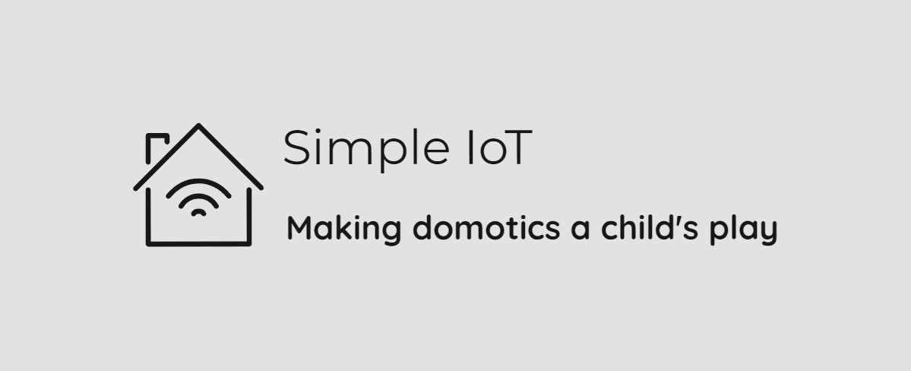

<div align="center">
  <a href="https://github.com/FedericoGarcia/Simple-IoT">
    
  </a>
</div>

<br />

<div align="center">
    <a href="https://github.com/FedericoGarcia/Simple-IoT/issues/new?assignees=&labels=bug&template=01_BUG_REPORT.md">
        Report a Bug
    </a>
    ·
    <a href="https://github.com/FedericoGarcia/Simple-IoT/issues/new?assignees=&labels=feature&template=02_FEATURE_REQUEST.md">
        Request a Feature
    </a>
    ·
    <a href="https://github.com/FedericoGarcia/Simple-IoT/discussions">
        Ask a Question
    </a>
</div>

<br />

<div align="center">
    <a href="LICENSE">
        
    </a>
    <a href="https://github.com/FedericoGarcia/Simple-IoT/issues">
        
    </a>
    <a href="https://github.com/FedericoGarcia/Simple-IoT/releases">
        
    </a>
    <a href="https://github.com/FedericoGarcia/Simple-IoT/releases">
        
    </a>
</div>

<br />

## About

Simple IoT is an open source home automation solution that uses readily
available hardware and robust yet easy to understand software.

Initially, the project is designed for a NodeMCU Devkit V1.0. Support for
other ESP8266-based microcontrollers will be added in future releases.

### Features

The following is a list of features that are or will be implemented in future
releases:

- [ ] Easy and fast configuration of the Wi-Fi network connection
- [ ] Over-The-Air (OTA) update
- [ ] REST API
- [ ] Customizable inputs and outputs
- [ ] Predefined device types
- [ ] Device discovery
- [ ] HTTPS
- [ ] Google Assistant support

## Installation

To get the latest version of the firmware you can go to the
[releases section](https://github.com/FedericoGarcia/Simple-IoT/releases).

There are many ways to flash the firmware, you can use esptool.py with the
command line, or use a GUI alternative like NodeMCU PyFlasher.

> Note: depending on your microcontroller model, you may need to set the device
to Flash Mode.

### Using command line

1. Download [esptool.py](https://github.com/espressif/esptool/releases)
2. Unzip the compressed file
3. Open a terminal inside the folder where the binaries are located
4. Run the following command:

```
esptool --port <serial-port> write_flash -fm <flash-mode> 0x0 <firmware>.bin
```

Where flash-mode is `qio` for most ESP8266 ESP-01/07 (512 kByte modules) and
`dio` for most ESP32 and ESP8266 ESP-12 (>=4 MByte modules).  
ESP8285 requires `dout`.

#### Examples

For Windows:

```powershell
> esptool --port COM3 write_flash -fm dio 0x00000 simple_iot_0.1.0.bin
```

For Linux and macOS:

```bash
$ esptool --port /dev/ttyUSB0 write_flash -fm dio 0x00000 simple_iot_0.1.0.bin
```

For more information, you can refer to
[esptool.py README file](https://github.com/espressif/esptool/blob/master/README.md)
and the
[NodeMCU documentation](https://nodemcu.readthedocs.io/en/latest/flash/).

### Using graphical interface

1. Download [NodeMCU PyFlasher](https://github.com/marcelstoer/nodemcu-pyflasher/releases)
2. Run the program
3. Select the serial port where the device is connected
4. Search and select firmware (*.bin file)
5. Select baud rate (typically 115200)
6. Select the flash mode
7. Click on "Flash NodeMCU"

## Usage

When the device is first powered on, it will create an access point with an
SSID such as "IoT_device_XXXXX", where XXXXX are case sensitive alphanumeric
characters (a-z, A-Z and 0-9).

Through the [API](#api), you will be prompted for the network you want the
device to connect to automatically.

### API

For more information about the API, visit the complete documentation [here](docs/API/API.md).

## Contributing
For contributing guidelines, please refer to
[CONTRIBUTING.md](./docs/CONTRIBUTING.md) file.

## Related resources

- [Arduino](https://www.arduino.cc/)
- [ASCIIFlow](https://asciiflow.com/)
- [C++](https://www.cplusplus.com/)
- [CH340 USB driver](http://www.wch.cn/download/CH341SER_EXE.html)
- [Git](https://git-scm.com/)
- [GitHub](https://github.com/)
- [NodeMCU documentation](https://nodemcu.readthedocs.io/)
- [PlatformIO](https://platformio.org/)
- [Postman](https://www.postman.com/)
- [Python](https://www.python.org/)
- [REST CookBook](https://restcookbook.com/)
- [Semantic Versioning](https://semver.org/)
- [SemVer check](https://jubianchi.github.io/semver-check/)
- [Visual Studio Code](https://code.visualstudio.com/)

<br>

---

<br />

<div align="center">
    <a href="https://www.gnu.org/licenses/gpl-3.0.html">
        
    </a>
</div>
